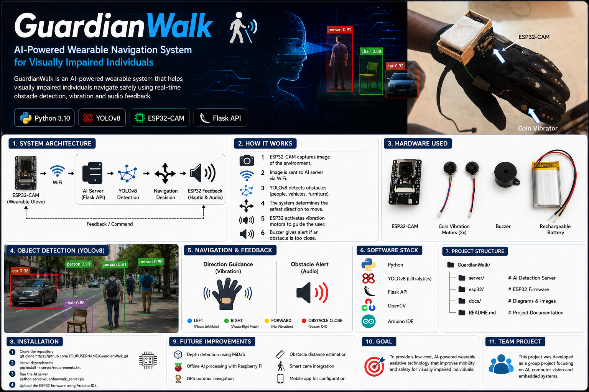

# 🧤 GuardianWalk

<p align="center">
  
</p>

<p align="center">
  <strong>AI-Powered Wearable Navigation System for Visually Impaired Individuals</strong>
</p>

<p align="center">
An intelligent wearable glove that combines <b>Computer Vision</b>, <b>Artificial Intelligence</b>, and <b>Embedded Systems</b> to provide real-time obstacle detection and navigation assistance.
</p>

---

# 📖 Overview

**GuardianWalk** is an AI-powered wearable assistive device developed to improve the mobility and safety of visually impaired individuals.

The system uses an **ESP32-CAM** mounted on a wearable glove to capture images of the surrounding environment. These images are transmitted wirelessly to a **Python-based AI server**, where a **YOLOv8 object detection model** identifies nearby obstacles. Based on the detection results, the system provides **vibration** and **audio feedback**, enabling users to navigate safely.

This project demonstrates the integration of **Artificial Intelligence, Computer Vision, Embedded Systems, IoT, and Real-Time Communication** into an affordable assistive technology solution.

---

# ✨ Key Features

- 🧠 AI-powered obstacle detection
- 📷 Real-time image capture using ESP32-CAM
- 🤖 YOLOv8 object detection
- 📡 Wi-Fi communication
- 📳 Haptic navigation using vibration motors
- 🔊 Audio alerts using buzzer
- 🧤 Wearable glove design
- ⚡ Lightweight and portable system

---

# 🎯 Objective

The primary objective of **GuardianWalk** is to provide visually impaired individuals with an affordable and intelligent wearable navigation system that detects obstacles in real time and assists them through intuitive vibration and audio feedback.

---

# 📚 Working Principle

1. The ESP32-CAM continuously captures images of the surrounding environment.
2. Images are transmitted to the AI server through Wi-Fi.
3. The AI server processes each image using the YOLOv8 object detection model.
4. Detected objects are analyzed to determine potential obstacles.
5. Navigation decisions are generated based on obstacle locations.
6. Commands are sent back to the ESP32.
7. The vibration motors and buzzer guide the user safely around obstacles.

---

# 🏗 System Architecture

<p align="center">

</p>

---

# 🔧 Hardware Components

| Component | Description |
|-----------|-------------|
| ESP32-CAM | Captures real-time images |
| Coin Vibration Motors (2x) | Directional haptic feedback |
| Buzzer | Audio warning for nearby obstacles |
| Rechargeable Lithium-ion Battery | Portable power source |
| Wearable Glove | Hardware mounting platform |

---

# 💻 Software Stack

| Technology | Purpose |
|-----------|---------|
| Python | AI Processing |
| YOLOv8 (Ultralytics) | Object Detection |
| OpenCV | Image Processing |
| Flask | Communication API |
| Arduino IDE | ESP32 Programming |

---

# 📸 Project Images

## Wearable Prototype

<p align="center">

</p>

---

## System Architecture

<p align="center">

</p>

---

## Object Detection

<p align="center">

</p>

---

# 🚀 Installation

### Clone the Repository

```bash
git clone https://github.com/joshua14134/GuardianWalk.git
cd GuardianWalk
```

### Install Python Dependencies

```bash
pip install -r server/requirements.txt
```

### Run the AI Server

```bash
python server/guardianwalk_server.py
```

### Upload ESP32 Firmware

1. Open the **esp32** folder in Arduino IDE.
2. Select the ESP32-CAM board.
3. Upload the firmware.
4. Connect the device to the same Wi-Fi network as the server.

---

# 🔄 System Workflow

```text
ESP32-CAM
      │
      ▼
Capture Image
      │
      ▼
Send via Wi-Fi
      │
      ▼
Python AI Server
      │
      ▼
YOLOv8 Detection
      │
      ▼
Navigation Decision
      │
      ▼
ESP32 Feedback
      ├── Left Vibration
      ├── Right Vibration
      └── Buzzer Alert
```

---

# 💡 Applications

- Assistive Technology
- Smart Wearable Devices
- AI-Based Navigation
- Embedded Systems
- Computer Vision Research
- Healthcare Technology
- IoT Applications

---

# 🚀 Future Enhancements

- 📏 Distance Estimation
- 🗺 GPS Navigation
- 🧠 Edge AI using Raspberry Pi
- 🎙 Voice Assistance
- 📱 Mobile Application
- ☁ Cloud Monitoring
- 🔋 Improved Battery Optimization
- 🦯 Smart Cane Integration

---

# 📚 Learning Outcomes

This project demonstrates practical knowledge in:

- Artificial Intelligence
- Computer Vision
- Deep Learning
- YOLOv8
- OpenCV
- Embedded Systems
- ESP32 Development
- Flask API Development
- Python Programming
- IoT Communication
- Wearable Device Design

---

# 👥 Team Project

GuardianWalk was developed as a collaborative academic project focused on designing an affordable AI-powered wearable navigation system for visually impaired individuals using Computer Vision and Embedded Systems.

---

# 👨‍💻 Developer

**Joshua Greg Colaco**

GitHub: https://github.com/joshua14134

---

# 📄 License

This project is licensed under the **MIT License**.

---

<p align="center">
⭐ If you found this project useful, consider giving it a <b>Star</b> on GitHub!
</p>
